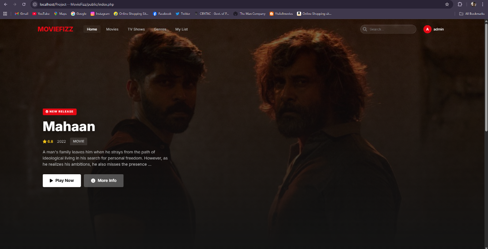
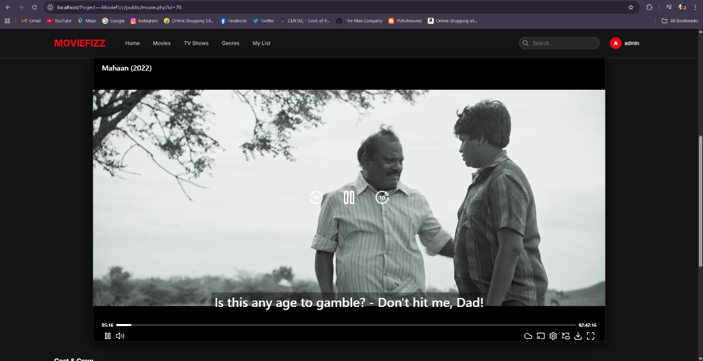
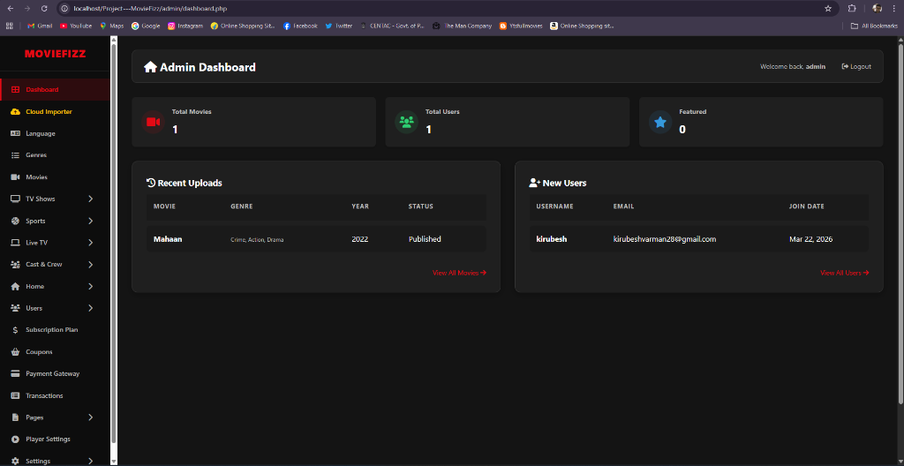

# MovieFizz - Premium Movie Streaming Platform

MovieFizz is a high-performance movie streaming application built with Core PHP, MySQL, and Vanilla JavaScript. It features a modern Netflix-style interface, TMDB integration, and a sophisticated Terabox video resolver.

## 🎥 Visual Preview


*Modern Netflix-style home page with featured content and categories.*


*Detailed movie information with integrated video player and metadata.*


*Comprehensive admin panel for content and user management.*

## 🚀 Key Features

### User Experience
- **Modern UI**: Sleek, responsive Netflix-style interface.
- **Search**: AJAX-powered live search for instant results.
- **Watchlist**: Users can save movies to their personal watchlist.
- **Advanced Player**: Custom HTML5 player with support for trailers and direct Terabox playback.

### Administration
- **TMDB Integration**: Automatically fetch movie metadata, posters, and backdrops.
- **Terabox Resolver**: Play Terabox videos directly without redirects.
- **FFmpeg Processing**: Automatically extract subtitles and secondary audio tracks from video streams.
- **User Management**: Control user access and view site statistics.

---

## 🛠️ Requirements

- **PHP**: 7.4 or 8.x (Recommended)
- **MySQL**: 5.7+ or MariaDB
- **FFmpeg**: Required for audio/subtitle extraction (Linux system package recommended).
- **Extensions**: `curl`, `pdo_mysql`, `mbstring`, `gd`.

---

## 📦 Installation (Localhost)

1. **Clone/Copy**: Move the project to your web root (e.g., `C:/xampp/htdocs/MovieFizz`).
2. **Database**:
   - Create a database (e.g., `moviefizz_db`).
   - Import `database.sql` and `expansion_schema.sql` via phpMyAdmin.
3. **Configuration**:
   - Edit `includes/config.php`:
     ```php
     define('DB_HOST', 'localhost');
     define('DB_NAME', 'moviefizz_db');
     define('DB_USER', 'root');
     define('DB_PASS', '');
     define('SITE_URL', 'http://localhost/MovieFizz');
     define('TMDB_API_KEY', 'YOUR_TMDB_API_KEY');
     ```
4. **Access**:
   - **Frontend**: `http://localhost/MovieFizz/public`
   - **Admin**: `http://localhost/MovieFizz/admin` (Default: `admin` / `admin123`)

---

## 🌐 Deployment (Live Server)

### Recommended: VPS (Oracle Cloud / Google Cloud / DigitalOcean)
A VPS is recommended if you want to use the **FFmpeg** features (audio/subtitle extraction).

1. **Install FFmpeg**:
   ```bash
   sudo apt update
   sudo apt install ffmpeg
   ```
2. **Setup Web Server**: Install Nginx/Apache, PHP, and MySQL.
3. **Upload**: Use SCP or Git to transfer the files.
4. **Permissions**: Ensure `uploads/` and its subdirectories are writable:
   ```bash
   chmod -R 775 uploads/
   ```

### Option 2: Shared Hosting (cPanel)
1. **Upload**: Upload all files to `public_html`.
2. **Database**: Create a MySQL DB and User in cPanel and import the SQL files.
3. **Config**: Update `includes/config.php` with live credentials.
4. **Note**: FFmpeg features will likely **not** work on shared hosting as they rarely permit running binaries.

---

## 🎁 Free Deployment Guide

If you want to host this project for free, here are your best options:

### 1. Oracle Cloud Free Tier (Best Performance)
This gives you a powerful VPS (4 ARM CPUs, 24GB RAM) for free forever.
- **FFmpeg Support**: ✅ Yes (Can be installed via `apt`).
- **Setup**: Create an instance, install LAMP stack (Linux, Apache, MySQL, PHP), and point your domain.
- **Difficulty**: Moderate (Requires Linux command line).

### 2. Google Cloud Free Tier (Reliable)
The `e2-micro` instance is free in some US regions.
- **FFmpeg Support**: ✅ Yes.
- **Difficulty**: Moderate.

### 3. Railway (Recommended Choice)
Railway is excellent for this project as it handles both the code and the database in one place.

#### Step-by-Step Setup:
1. **GitHub Import**: Log in to [Railway.app](https://railway.app/) and click **New Project** > **Deploy from GitHub Repo** > Select `Project---MovieFizz`.
2. **Add MySQL**: Click **New** > **Database** > **Add MySQL**. This adds a dedicated database service to your project.
3. **Environment Variables**: 
   - Click on your **web service** (the one from GitHub) > **Variables** tab.
   - Click **New Variable** and add the following (copy these exact names):
     - `DB_HOST`: `${{MySQL.MYSQLHOST}}`
     - `DB_NAME`: `${{MySQL.MYSQLDATABASE}}`
     - `DB_USER`: `${{MySQL.MYSQLUSER}}`
     - `DB_PASS`: `${{MySQL.MYSQLPASSWORD}}`
     - `TMDB_API_KEY`: (Your TMDB API Key)
     - `APIFY_TOKEN`: (Your Apify Token)
4. **Import Database**:
   - Go to the **MySQL service** > **Connect** tab.
   - Copy the "Command Line" connection string.
   - On your local machine, run: `mysql -h [host] -u [user] -p[pass] [dbname] < database.sql` (Replace brackets with details from the Connect tab).
5. **Done!**: Railway will auto-redeploy, and your site will be live at the provided URL.

#### Pros:
- ✅ FFmpeg is auto-installed (via `nixpacks.toml`).
- ✅ Real MySQL database included.
- ✅ High performance.

### 4. Render (Reliable Free PHP Hosting)
Free shared hosting with no ads.
- **FFmpeg Support**: ❌ No.
- **Difficulty**: Easy (Upload via FTP, use cPanel).
- **Limitation**: You won't be able to use the "Auto-Extract Subtitles/Audio" feature.

### 4. Render / Railway / 000webhost
Other options for hosting PHP, but they often have strict resource limits or requires a credit card even for free tiers.

---

## 🔧 FFmpeg & Terabox Setup

To enable direct Terabox playback with extracted subtitles:
1. Ensure the `uploads/subtitles/` and `uploads/audio/` folders exist and are writable.
2. The system expects `ffmpeg` and `ffprobe` to be available in the system path (on Linux) or will look for them in an `ffmpeg_bin` folder (on Windows). 

---

## 📄 License
This project is for educational and personal use.
